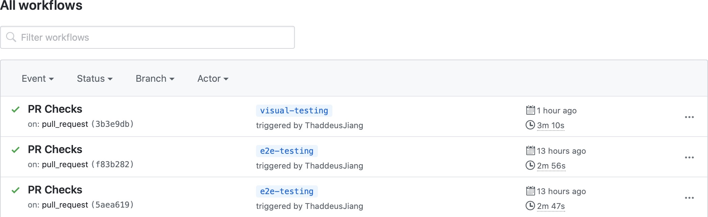
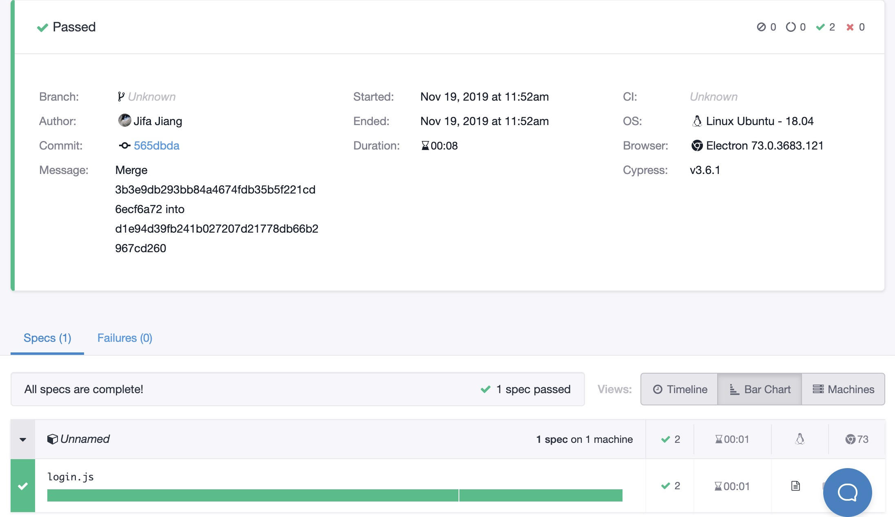
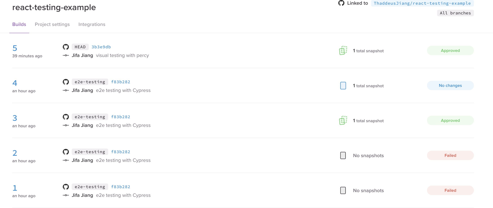

# React Testing Example

[](https://percy.io/Jifa/react-testing-example)

This project was bootstrapped with [Create React App](https://github.com/facebook/create-react-app).

## Related

- [React Testing 1 - Unit Testing](https://jifa.name/blog/2019-11-18--react-testing-1-unit/)
- [React Testing 2 - E2E Testing](https://jifa.name/blog/2019-11-19--react-testing-2-e2e/)
- [React Testing 3 - Visual Testing](https://jifa.name/blog/2019-11-19--react-testing-3-visual/)

## Get Started

```bash
yarn

yarn start
// open http://localhost:3000
```

### Unit Test

```
yarn test
```

### E2E Test

```
yarn cy:open
```

### Visual Test

```
yarn cy:record
```

## [GitHub Actions Status](/actions)



## [E2E Testing Report](https://dashboard.cypress.io/#/projects/d1urg6/runs)



## [Visual Testing Report](https://percy.io/ThaddeusJiang/react-testing-example)


